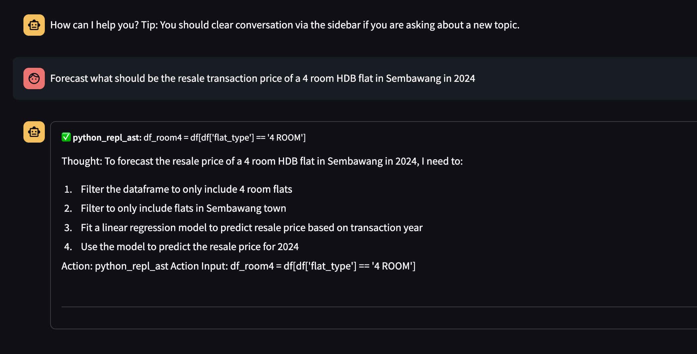
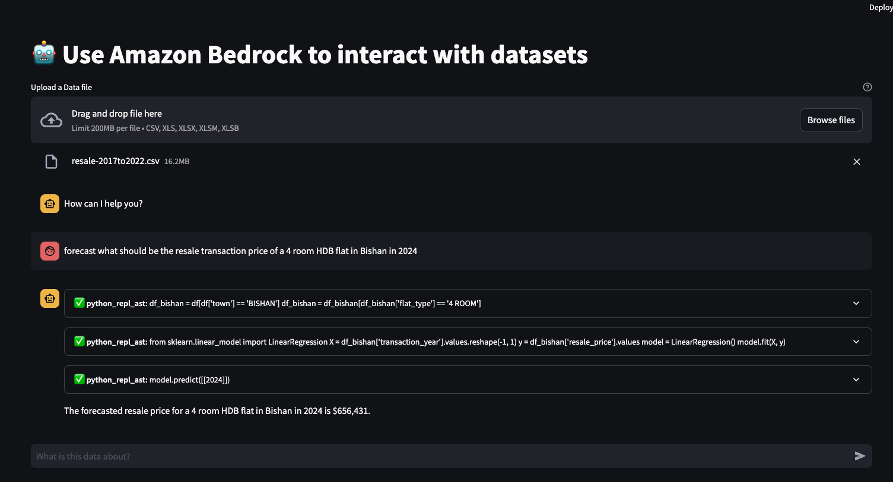

# Use Bedrock to analyze your datasets

LLMs have the potential to automate many tasks when given the ability to interact with other systems. In this example, we use Amazon Bedrock deployed models as our reasoning engine, to interact with Pandas dataset using the Python interpreter.

## Requirements
1. Amazon Bedrock access
2. A safe, isolated compute environment with Python installed
3. Install packages in requirements.txt

## How to run
1. Change your login password by copying `streamlit_example.yaml` to `streamlit.yaml`, and generating a hash password using Python:
```
import streamlit_authenticator as stauth
stauth.Hasher(['mypassword']).generate()
```
Replace the hashed password field with the output of the above command
2. Deploy using 
```
streamlit run streamlit_app.py --browser.serverAddress 0.0.0.0 --server.maxUploadSize=5000
```

## Examples



Examples use publicly available data accessible at [data.gov.sg](https://data.gov.sg).